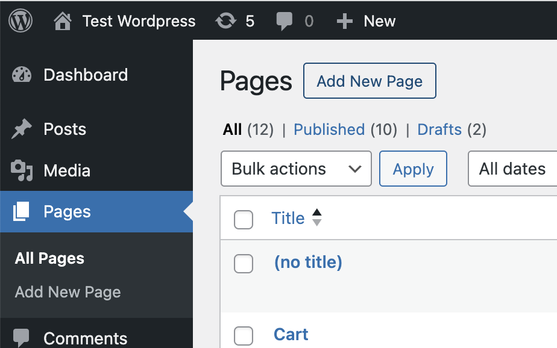
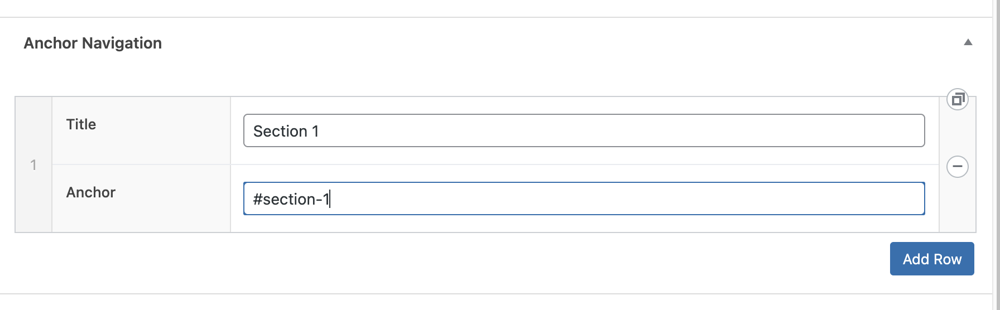
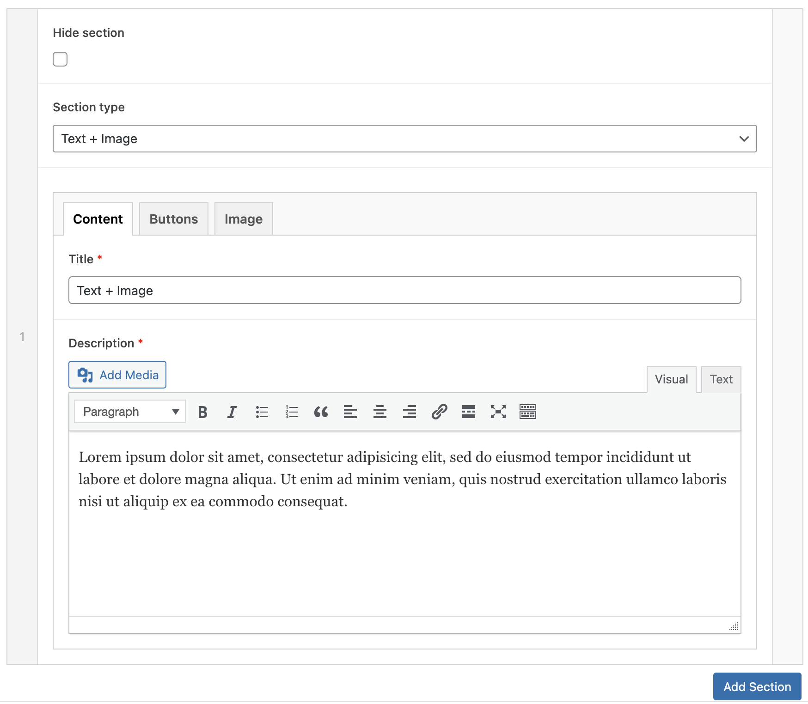

# Landing theme instruction

To add new landing page you should go Pages -> Add New Page :

When will be create new page you should switch template to "Landing
page" on the right sidebar:

If you do this, will be displayed two new sections (Anchor Navigation,
Landing page builder) on the bottom of the page:

### 1.  Section "Anchor Navigation"

> Use this section to configuring anchor menu at the top on the landing
> page.
>
> To add new menu item, click on the button "Add row" and enter two
> parameters: "Title" and "Anchor". For example: "Section 1" and
> "#section-1":
>
> 

### 2.  Section "**Landing page builder**"

> Use this section to add new sections to the Landing page. To add new
> section click on the button "Add section" on the bottom:
>
> 
>
> When you click on the bottom you will see the section like next:
>
> 
>
> Each section, which we add will add a unique section ID in the
> following format:
>
> section-{section number}
>
> You can use this ID in the anchor menu.
>
> For example, you add your first section. This section will have the
> unique ID "section-1". You may add the anchor "#section-1" to the
> anchor menu.
>
> If you select the option "Hide section" this section will be hidden on
> the client side of the site, but all data in the admin panel will be
> saved.
>
> In this theme implemented three kinds of the sections: "Text + Image",
> "2/3 Column Card", "Image gallery + Text". You may choice type of the
> section in the field "Section type":
>
> 
>
> If you change the value in this field the content blocks will be
> changed to. Those content fields may look at three kinds (for one to
> each section type):
>
> 
>
> 
>
> 
>
> All blocks are intuitive to fill.
